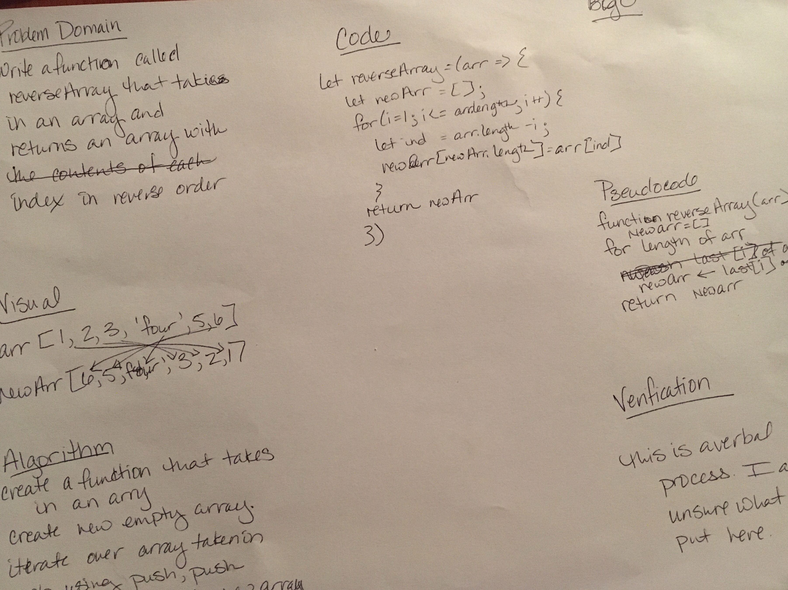

# data-structures-and-algorithms
Daily code challenges 

# Reverse an Array
Without using built in methods, return an array with the contents in reverse order of an existing array.

## Challenge
reverseArray takes in an array and returns a new array wit the contents of the original array in reverse order of the original array. 

## Approach & Efficiency
I wrote a for loop so I could first isolate the last index of an array. Once I was able to do that I was stumped as to how to push to a new array without the push() method. So I consulted stack overflow and was pleased to quickly find code that made sense: use the length of the new array to reassign THAT index with the previously isolated index value. 
[Stack Overflow link](https://stackoverflow.com/questions/25625991/how-to-add-an-element-to-an-array-without-any-built-in-functions)

## Solution

