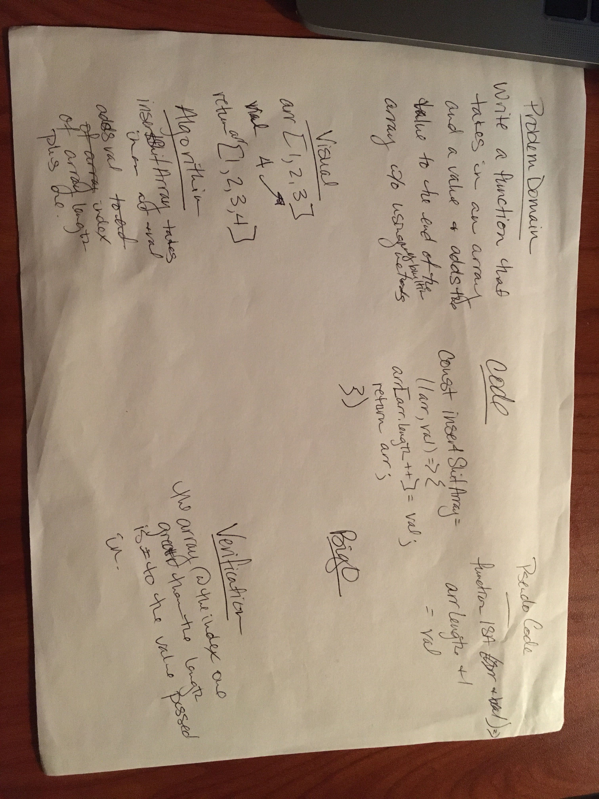

# data-structures-and-algorithms
Daily code challenges 

# Reverse an Array
Without using built in methods, return an array with the contents in reverse order of an existing array.

## Challenge
reverseArray takes in an array and returns a new array wit the contents of the original array in reverse order of the original array. 

## Approach & Efficiency
I wrote a for loop so I could first isolate the last index of an array. Once I was able to do that I was stumped as to how to push to a new array without the push() method. So I consulted stack overflow and was pleased to quickly find code that made sense: use the length of the new array to reassign THAT index with the previously isolated index value. 
[Stack Overflow link](https://stackoverflow.com/questions/25625991/how-to-add-an-element-to-an-array-without-any-built-in-functions)

## Solution

# Array Shift
Without using built in methods, return an array with a index added to the end.

## Challenge
insertShiftArray takes in an array and a value to be added to an end of an array, and without using any built in methods, returns an array with the new value added to the end. Please note that .length is a property of Array and not a method, as my semi extensive google search claimed. 

## Approach & Efficiency
I simply added a value at array.length index ++. 

## Solution

# Reverse an Array
Without using built in methods, return an array with the contents in reverse order of an existing array.

## Challenge
reverseArray takes in an array and returns a new array wit the contents of the original array in reverse order of the original array. 

## Approach & Efficiency
I wrote a for loop so I could first isolate the last index of an array. Once I was able to do that I was stumped as to how to push to a new array without the push() method. So I consulted stack overflow and was pleased to quickly find code that made sense: use the length of the new array to reassign THAT index with the previously isolated index value. 
[Stack Overflow link](https://stackoverflow.com/questions/25625991/how-to-add-an-element-to-an-array-without-any-built-in-functions)

## Solution

# Binary Shift
Without using built in methods, take in an assorted array and a number and check to see if the number is in the array. 

## Challenge
binaryShift takes in a sorted array and a number and using binary shift method, checks to see if the number is in the array. If it is the array return the index of the number, if it is not, return a -1

## Approach & Efficiency

## Solution

